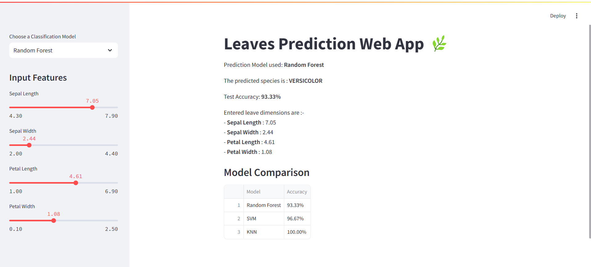

# 🌸 Iris Flower Classification - Streamlit Web App

This is a simple and interactive Streamlit web application that classifies Iris flowers into one of three species using different machine learning models:  
- **Random Forest**  
- **Support Vector Machine (SVM)**  
- **K-Nearest Neighbors (KNN)**

The app also provides a model comparison table displaying the accuracy of each classifier on the Iris dataset.

---

## 📸 Screenshot



---

## 🚀 Features

- Choose between three classification models from the sidebar
- Input flower features using intuitive sliders
- View real-time predictions and model accuracy
- Compare all models based on test accuracy

---

## 📊 Models Used

- **Random Forest**
- **Support Vector Machine (SVM)**
- **K-Nearest Neighbors (KNN)**

---

## 📦 Installation

1. **Clone the repository**  
   ```bash
   git clone https://github.com/NishantSuhag02/streamlit_ml_app.git
   cd streamlit_ml_app
   ```

2. **Install the dependencies**  
   ```bash
   pip install -r requirements.txt
   ```

3. **Run the Streamlit app**  
   ```bash
   streamlit run ml_streamlit.py
   ```

---

## 📁 Project Structure

```
├── ml_streamlit.py       # Main Streamlit application
├── requirements.txt      # Required Python packages
├── README.md             # Project documentation
└── screenshot.png        # App screenshot
```

---

## ✨ Example Use

Once the app is running, use the sidebar sliders to set:

- Sepal Length (cm)
- Sepal Width (cm)
- Petal Length (cm)
- Petal Width (cm)

The model will output the **predicted species** and show your selected measurements.
